# Social Media Sentiment Analysis

## Dataset
The dataset contains 1,600,000 tweets extracted using the twitter api. The tweets have been classified from 0 (negative) to 4 (positive). The dataset contains 6 fields which are target as integer, ids as integer, date as date, flag as string, user as string and text as string.These 6 fields are shown below.
* target: The polarity of the tweet (0 - negative, 2 - neutral, 4 - positive)
* ids: The id of the tweet.
* date: The date of the tweet.
* flag: The query. If there is no query, then this value is NO_QUERY.
* user: The user that tweeted.
* text: The text of the tweet

We remove tweets that have a length of 0. After this process, the dataset has a dimension of 1592328×2
Positive and negative samples are equal. The dataset distribution has not any skewness as shown below.
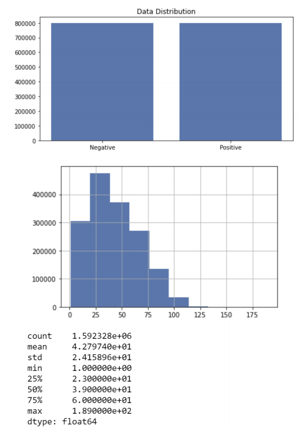

# Preprocessing
## Chart/Figures of Attribute
## Number of Letters
We provide the frequency and the relative frequency of the letters of whole tweets. Finally, we apply a chi-square test to test if the distribution of the letters in tweets is the same with what we see in English texts.
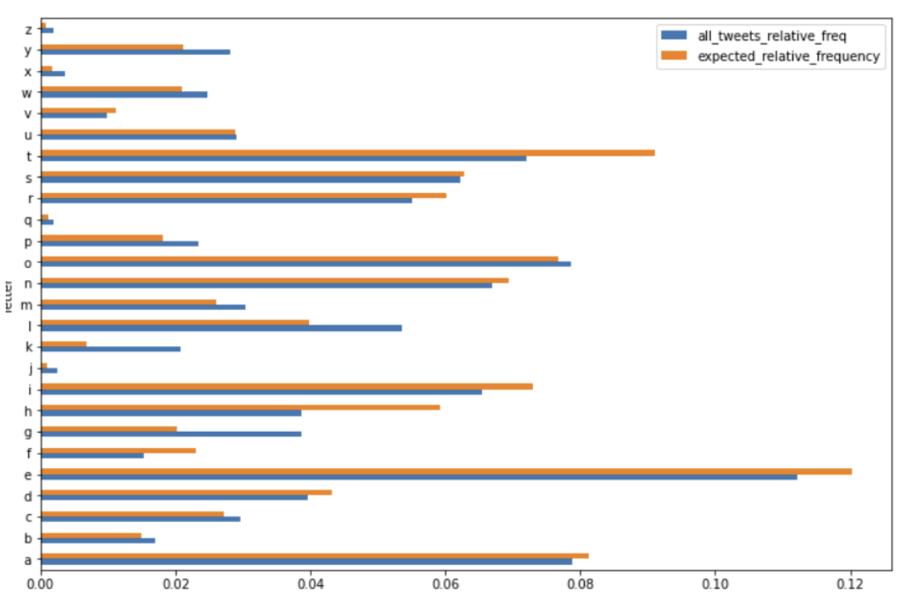

We got the p-value (p) as 0 which implies that the letter frequency does not follow the same distribution with what we see in English tests, although the Pearson correlation is too high (~96.7%).
|            |      Frequency      |  Expected |
|----------  |:-------------: |------:   |
| frequency  |    1.0         | 0.967421 |
| expected   |    0.967421    |   1.0     |

We counted the number of characters for each tweet and analyzed the data frame according to maximum number of characters, minimum number of characters, mean of the number of characters column and its standard deviation. Our longest tweet is 189 characters long, the shortest tweet is 1 character long and mean of all tweets’ character length 42.78. The standard deviation of all tweet character length is 24.16.

## Number of Characters
We counted the number of words for each tweet and analyzed the data frame according to maximum number of words, minimum number of words, mean of the number of words column and its standard deviation. Our longest tweet is 50 words long, the shortest tweet is 1 word long and the mean of all tweets’ word length is 7.24. The standard deviation of all tweet character length is 4.03.

### Most Common Words in Dataset
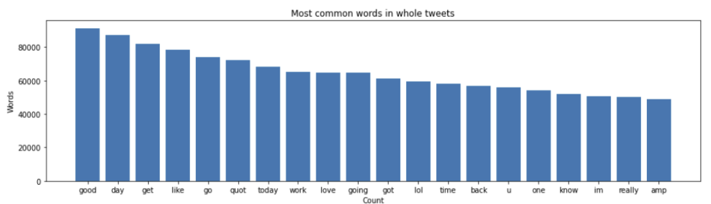

## Positive Tweets
### Most Common Words in Positive Tweets
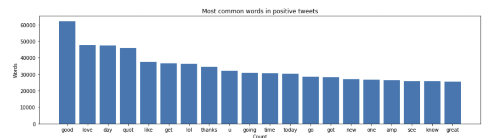
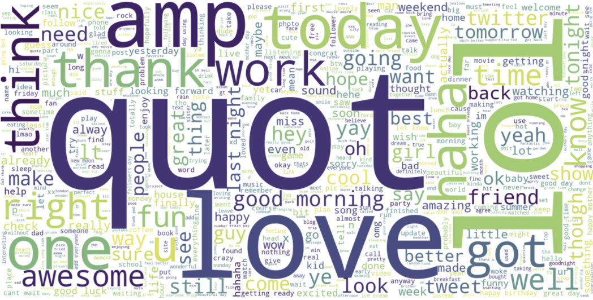

## Negative Tweets
### Most Common Words in Negative Tweets
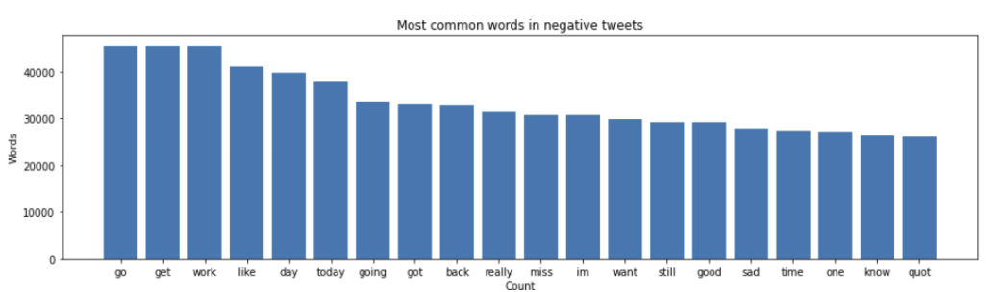
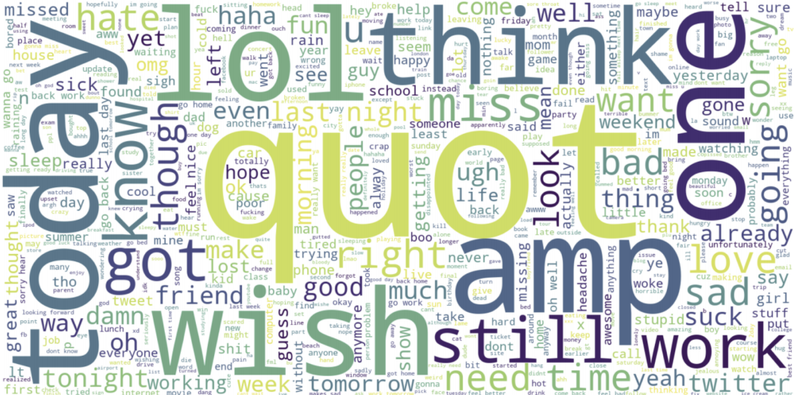

## GloVe: Global Vectors for Word Representation
We can train the embedding ourselves. However, that approach can take a long time to train. So, we use transfer learning technique, and we use GloVe: Global Vectors for Word Representation.
  The Global Vectors for Word Representation, or GloVe, algorithm is an extension to the word2vec method for efficiently learning word vectors, developed by Pennington, et al. at Stanford. It is an unsupervised learning algorithm for obtaining vector representations for words. Training is performed on aggregated global word-word co-occurrence statistics from a corpus, and the resulting representations showcase interesting linear substructures of the word vector space. 
  We download the GloVe. Then, we initialize an embedding index that has 400000 word vectors, and embedding matrix.

## Scatter Plot
We used feature extraction methods, bag-of-words, and word embedding.
Bag of words with TF-IDF is a common and simple way of feature extraction.
Bag-of-Words is a representation model of text data and TF-IDF is a calculation
method to score the importance of words in a document.
After applying bag-of-words with TF-IDF, we create the scatter plot according
to these results.

### Scatter plot that shows correlation of words in the corpus: red indicates negatives, blue indicates positives.
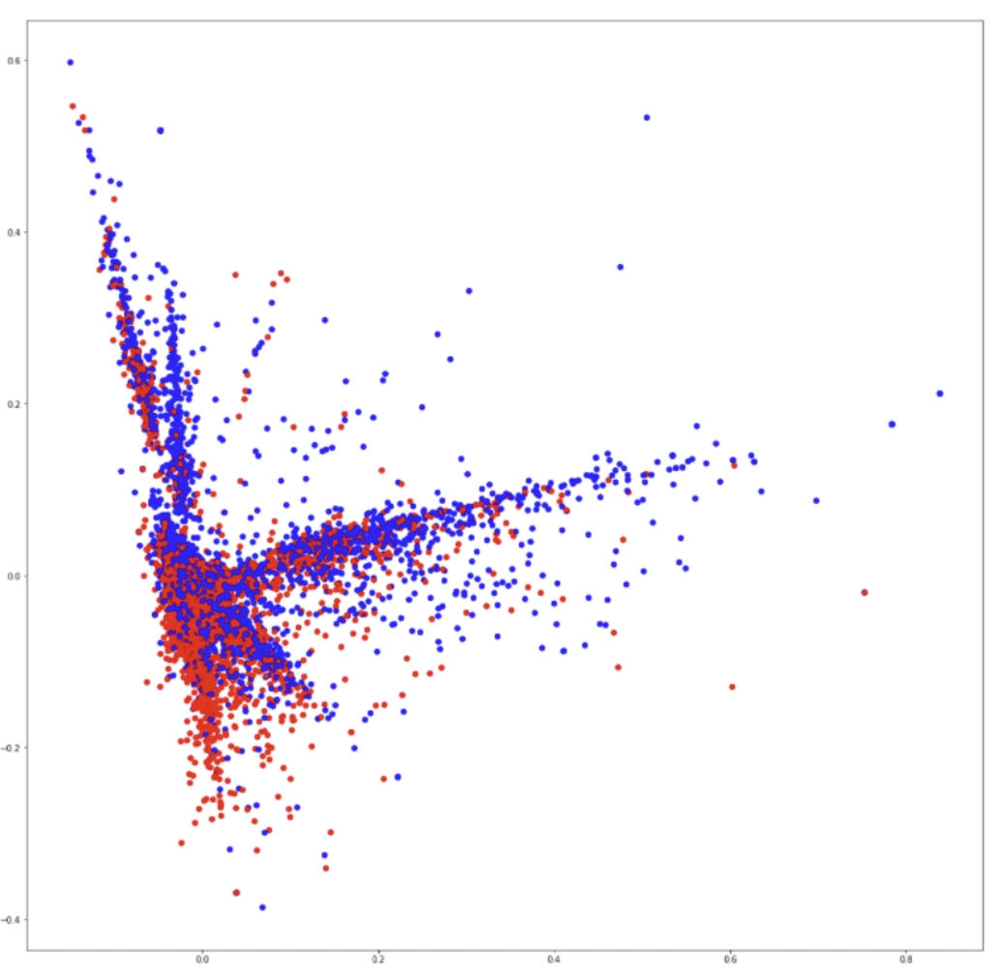

## Preprocessing Results
we explored our dataset by applying some analyses to the
attributes and created related charts. There are 2 attributes in our dataset including
label attribute. We applied these analyses on them.
We explored the tweets by looking at the letters and words in them. First of
all, we counted the letters of all tweets and calculated the letter frequencies. Then
we compared the letter frequency of our data with the expected frequency of the
letters of the alphabet of English. Even though there are some exceptions, for most of the letter, the
frequencies of our data is really close to the expected ones.
The number of characters and words are also counted and analysed.
Minimum number of characters of all tweets is 1 whereas the maximum number is
189. Since the mean is around 42 and standard deviation is around 24, it can be said
that a small number of tweets has a high number of characters. The similar result
can be seen in word analysis . When the number of words counted, it is seen that
the maximum number of words in tweets is 50 whereas the minimum number is 1.
Mean is around 7 and standard deviation is around 4 which gives a similar result with
the number of characters. Very small number of tweets has a high number of words.
According to these results, it can be interpreted that both the number of characters
and number of words graphs are skewed graphs.
After counting the number of words used in tweets, word usages are
analysed. Since the stop words are usually the most used words in texts and they
may prevent us from getting the right results, they are calculated by filtering the
stopwords. Also, most common words for positive
and negative labels are separated.
Then, a scatter plot is obtained by using some feature extraction methods. The plot shows the correlation between the
words.

# Predictive Analysis
For classification/regression experiments, the test set percentage is set to be
20%. 6 different models that are applied are CNN Model-1, CNN Model-2, LSTM
Model-1, LSTM Model-2, Naive Bayes Model-1 and Naive Bayes Model-2. Below,
precision, recall, f1 score and accuracy of the models are shown.

## Classification/Regression
* CNN Model-1: Conv1D = 64, Dense=512, Dense=512, 1024 Batch Size
* CNN Model-2: Conv1D = 64, Dense=512, Dense=512, 512 Batch Size
* LSTM Model-1: 1024 Batch Size
* LSTM Model-2: 512 Batch Size
* Multinomial Naive Bayes Model-1: Count Vectorizer
* Multinomial Naive Bayes Model-1:  TF-IDF

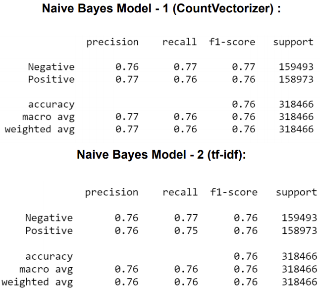
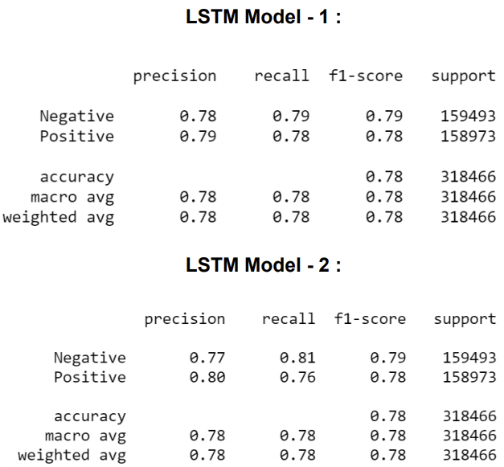
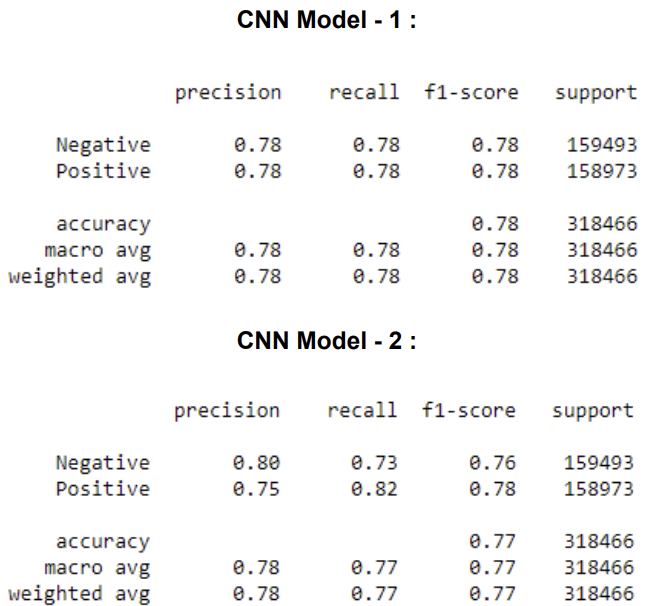

## ROC Curves
After determining the evaluation metrics, ROC curves of the models are
formed. Also AUC values are calculated and shown at the bottom of each graph.
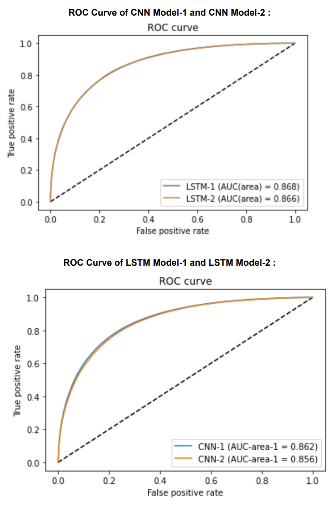
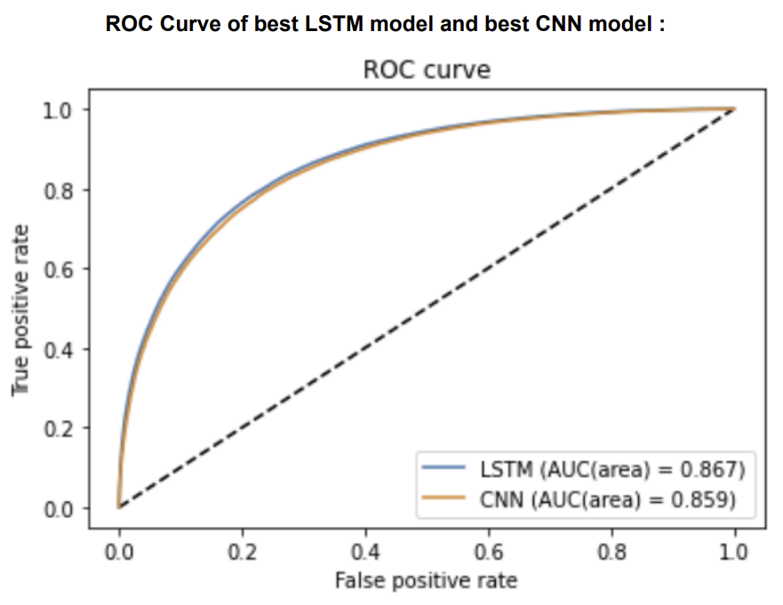

## Confusion Matrix
Confusion matrices of the 6 model used to train the data, including the best
performing model LSTM-1, are as follows:

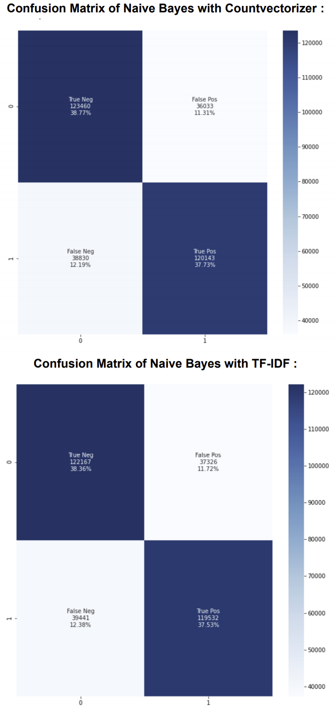
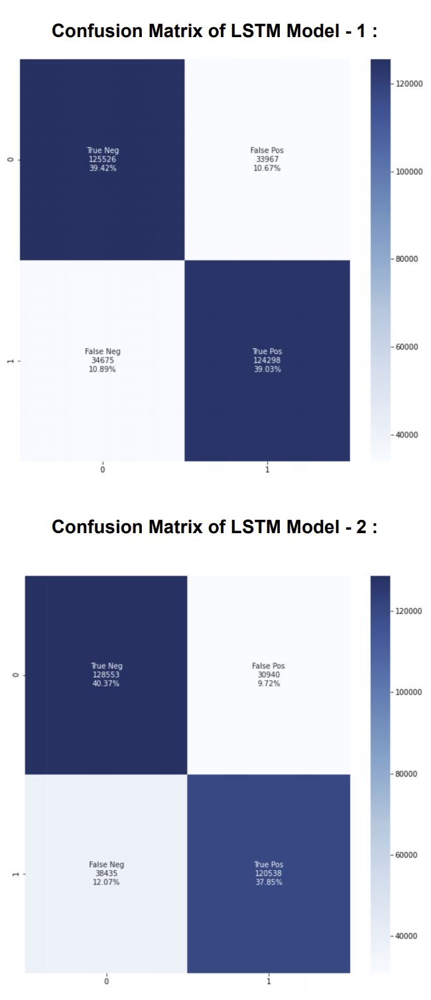
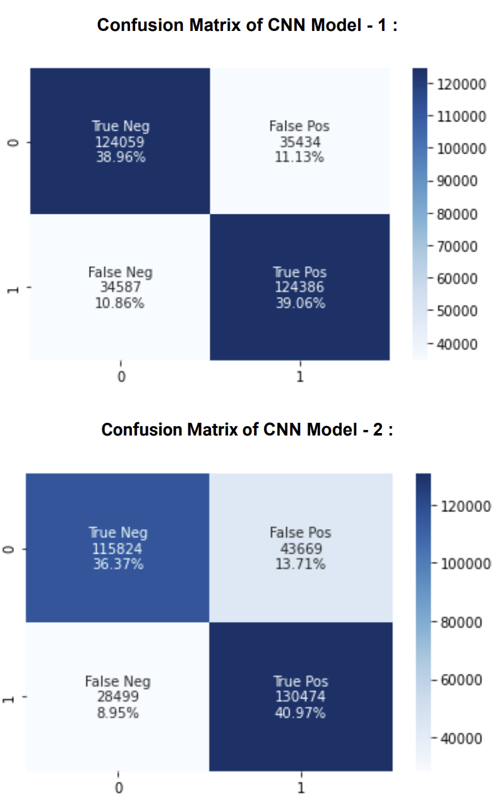

## Statistical Significance Analysis
According to Accuracy, P, R, F1, AUC, our best performing model is LSTM
model 1 with 1024 batch size and 0.789 accuracy and the closest competitor to
LSTM model 1 is CNN model 1 with accuracy 0.781. Multinomial Naive Bayes with
tf-idf is the worst performing algorithm among them with accuracy 0.758.

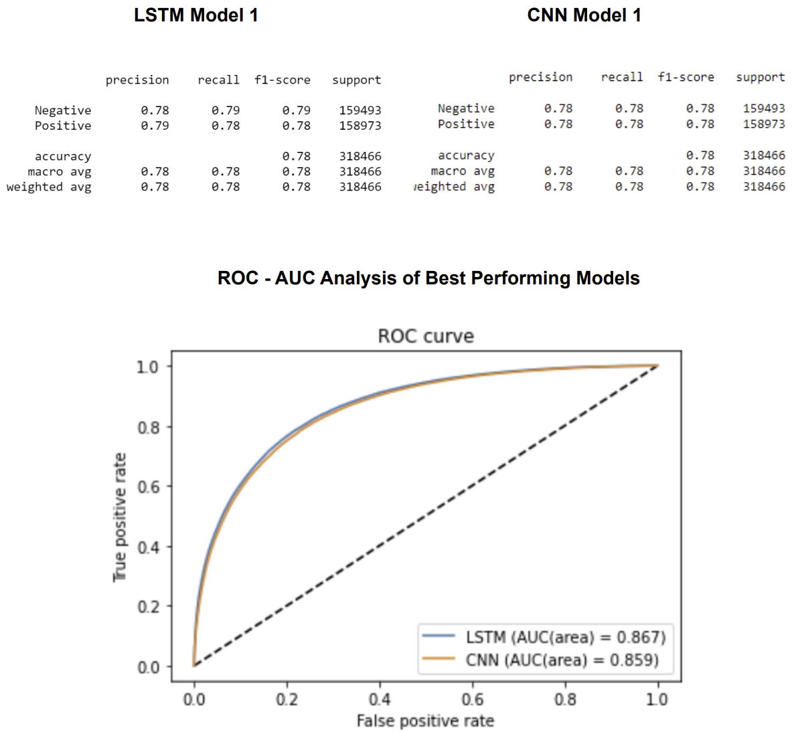

## Predictive Analysis Results
Our raw dataset has unnecessary features for our purpose. Its first entropy
value was 41.08. Then we dropped the unnecessary columns, deleted the empty
valued rows, and we have obtained an entropy value of 14.73. After this preprocess,
we can easily see that there is an important change in entropy values.
After all six experiments, we can see that different LSTM and CNN give us
very close accuracy ratios after training. Although there are really low differences,
LSTM Model-1 has the best result and Naive Bayes models performed slightly
worse.
Naive Bayes models have the best training time durations. It has very good
speed compared to LSTM and CNN models. LSTM model-1, LSTM model-2 and
CNN model-1 have close training times as each epoch takes 10 to 13 minutes for
these models. Although changing the batch size in LSTM did not give an effective
result difference, CNN model-2 has a better training time like 7 to 8 minutes for each
epoch. Also, its accuracy is really close to the others.
LSTM model-1 has 78.9% accuracy rate with 1024 batch size and LSTM
model-2 has 78.6% accuracy rate with 512 batch size. CNN model-1 has 78.2%
accuracy rate with 1024 batch size and CNN model-2 has 77.2% accuracy rate with
512 batch size. Both algorithms have better training times with 512 batch size, are
better than their 1024 batch sized models and their accuracy rates are really close.
As a result of these, we can say that LSTM and CNN models with 1024 batch size
are better for accuracy rate. But, models with 512 batch size have close accuracy
rates within better training times.
For accuracy rates of Naive Bayes models there is a small difference like
1.5%. As a result of that, we can say that Naive Bayes with the CountVectorizer
method gives better results than Naive Bayes with the TF-IDF method.

